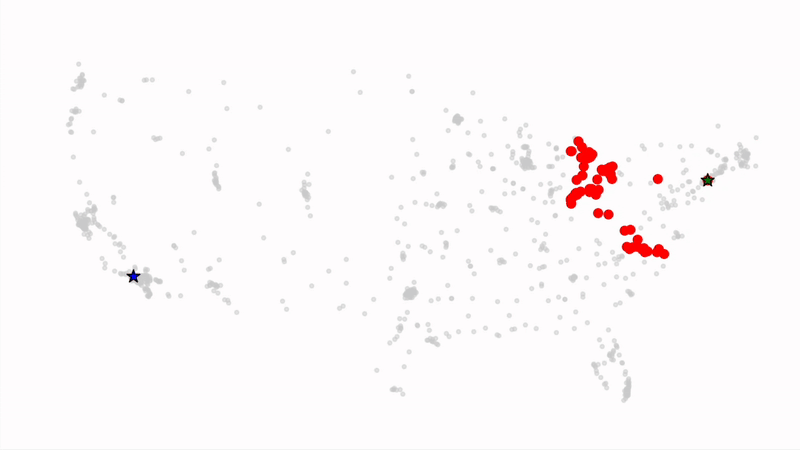

# City Routes



A Julia project for minimum path cost search in urban networks.

## Installation

### Prerequisites

- Julia 1.6 or higher

### Option 1: Using the Julia Package Manager

1. Clone this repository:

   ```
   git clone https://github.com/yourusername/city-routes.git
   cd city-routes
   ```

2. Start Julia with the project activated:

   ```
   julia --project=.
   ```

3. Install dependencies:
   ```julia
   using Pkg
   Pkg.instantiate()
   ```

## Usage

Run the main script:

```
julia --project=. main.jl
```
